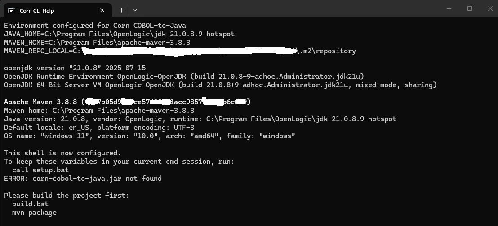
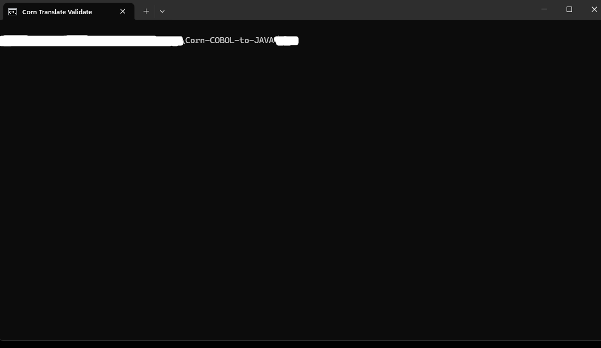
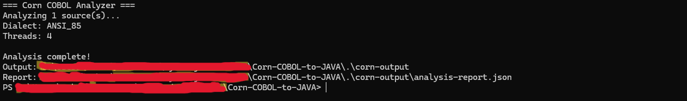
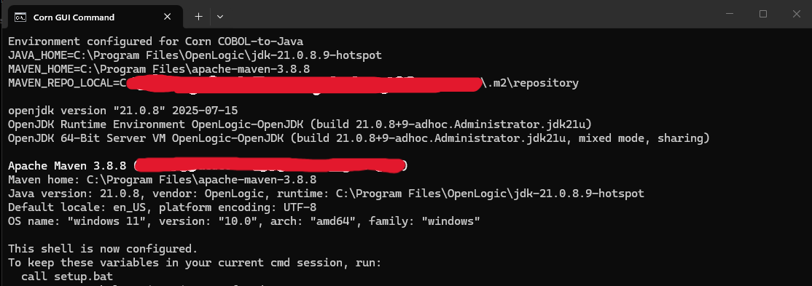

# Corn COBOL-to-Java Compiler

COBOL-to-Java translation toolchain built with Java 21 and Maven.

[](https://github.com/sekacorn/corn-cobol-to-java/actions/workflows/ci.yml)
[](LICENSE)
[](https://openjdk.org/)
[](https://maven.apache.org/)

## Overview

Corn is a multi-module Java project for parsing COBOL, building an intermediate representation, generating Java, and providing a small runtime for COBOL semantics. The current repository is an evaluation-stage implementation focused on the core translation pipeline.

What is in this repository today:
- COBOL lexer/parser built with ANTLR4
- Intermediate representation for programs, expressions, and statements
- Java code generation for the current supported translation path
- Runtime helpers for numerics, strings, and file operations
- Picocli-based CLI commands for init, analyze, translate, validate, report, refactor, and gui
- Execution-based validation for the current supported subset using expected stdout fixtures

What is not in this repository yet:
- Separate `semantics`, `transforms`, `validator`, `server`, or `ui-desktop` modules
- A full multi-level code generation implementation
- Production-grade validation against GnuCOBOL execution outputs
- Complete COBOL dialect coverage

## Screenshots

### CLI Help

The CLI banner and available commands:



### Translate

Translating 9 COBOL programs to Java with zero errors:



### Validate

Validating the full parse-generate-compile-execute pipeline:


### Analyze

Analyzing COBOL source files and generating a JSON report:



### Workspace Explorer

The `gui` command opens the workspace in the system file explorer:



## Current Status

The codebase currently ships these Maven modules:

```text
modules/
  cli
  codegen-java
  ir
  lexer-parser
  runtime-java
```

Implemented pipeline:

```text
COBOL source (.cbl)
  → CobolPreprocessor (fixed-form → free-form normalization)
  → ANTLR4 Lexer/Parser (CobolLexer.g4 / CobolParser.g4)
  → CobolIRBuildingVisitor (parse tree → immutable IR)
  → JavaCodeGenerator (IR → Java source via visitor pattern)
  → Generated Java (imports com.sekacorn.corn.runtime.*)
```

The CLI advertises four code generation levels, but only level `2` is implemented at this time. The `translate` command now fails fast for levels `0`, `1`, and `3`.

## Features Available Now

### Parsing and IR
- ANTLR4 COBOL grammar targeting the ANSI-85 COBOL subset
- Fixed-format preprocessing with string literal continuation handling
- Data definitions, procedure statements, expressions, conditions, file control, and `INSPECT` support in the current parser/IR flow
- Word-form comparison operators (`EQUAL`, `GREATER`, `LESS`) alongside symbol operators
- Level 88 condition names with `VALUES ARE`, `THRU`/`THROUGH` ranges, and signed literals
- Comma and semicolon treated as optional separators (skipped by lexer)

### Java Code Generation
- Java source generation from parsed COBOL programs
- Paragraph/section translation into Java methods
- Working-storage and file-section field generation
- Generated file-status propagation into declared COBOL status fields

### Runtime Support
- COBOL-style numeric helpers
- COBOL string helpers including `INSPECT`
- Basic file runtime abstractions used by generated code

### CLI Commands
- `init`: creates a basic workspace config
- `analyze`: parses COBOL files and writes a JSON analysis report
- `translate`: parses and generates Java source
- `validate`: parses, generates Java, compiles generated Java, executes it, and can compare stdout against expected `.out` fixtures for the supported subset
- `report`: generates basic HTML, JSON, Markdown, or placeholder PDF reports
- `refactor`: performs baseline Java text cleanup; it is not yet a full LLM workflow
- `gui`: opens the workspace in the system file explorer; it is not a JavaFX desktop application

## MVP Boundary

This repository should currently be treated as an MVP for a bounded COBOL subset, not as a general COBOL modernization platform.

Supported MVP workflow:
- `translate --codegen-level 2` for the currently covered subset
- `validate` for parse -> generate -> compile -> execute validation
- optional expected-output fixtures named `<PROGRAM-ID>.out` or `<source-file>.out`

Supported MVP program shapes today are represented by the integration corpus in `modules/codegen-java/src/test/resources/cobol/`:
- hello-world style programs
- basic arithmetic (`ADD`, `SUBTRACT`, `MULTIPLY`, `DIVIDE`, `COMPUTE`)
- control flow (`IF`/`ELSE`, `EVALUATE`/`WHEN`, nested conditionals)
- `PERFORM` variants (simple, `UNTIL`, `VARYING`, `TIMES`)
- `STRING`/`UNSTRING` operations
- working-storage/data definitions
- current file-I/O compilation path
- current `INSPECT` support through runtime-backed code generation

### COBOL Statements Supported

| Category | Statements |
|----------|-----------|
| **Arithmetic** | `ADD`, `SUBTRACT`, `MULTIPLY`, `DIVIDE`, `COMPUTE` (with `ROUNDED`, `ON SIZE ERROR`, `NOT ON SIZE ERROR`, multi-target, `GIVING` with per-target `ROUNDED`, Format 1 and Format 2) |
| **Control Flow** | `IF`/`ELSE`, `EVALUATE`/`WHEN`/`WHEN OTHER`, `PERFORM` (simple, `UNTIL`, `VARYING`, `TIMES`, `TEST BEFORE`/`AFTER`), `GO TO`, `STOP RUN`, `EXIT`, `GOBACK`, `ALTER` |
| **Data Movement** | `MOVE`, `INITIALIZE`, `SET` |
| **Data Definition** | Level 01-77 items, level 88 condition names (`VALUE`/`VALUES`, `IS`/`ARE`, `THRU`/`THROUGH` ranges, signed literals), `USAGE` shorthand, `REDEFINES`, `OCCURS`, `SIGN`, `JUSTIFIED`, `SYNCHRONIZED` |
| **I/O** | `DISPLAY`, `ACCEPT` (with `FROM DATE`/`DAY`/`TIME`), `OPEN`, `CLOSE`, `READ`, `WRITE` (with `ADVANCING`), `REWRITE`, `DELETE`, `START` |
| **String** | `STRING`, `UNSTRING`, `INSPECT` (`TALLYING`, `REPLACING`, `CONVERTING`) |
| **Program** | `CALL` (with `ON EXCEPTION`), `SEARCH` |
| **Comparison** | Symbol operators (`=`, `>`, `<`, `>=`, `<=`) and word-form operators (`EQUAL TO`, `GREATER THAN`, `LESS THAN`, `NOT EQUAL TO`) |

### Sample Translation

**COBOL input:**
```cobol
       IDENTIFICATION DIVISION.
       PROGRAM-ID. ARITHMETIC.
       DATA DIVISION.
       WORKING-STORAGE SECTION.
       01  WS-A       PIC 9(5) VALUE 100.
       01  WS-B       PIC 9(5) VALUE 50.
       01  WS-RESULT  PIC 9(5) VALUE 0.
       PROCEDURE DIVISION.
           ADD WS-A TO WS-B GIVING WS-RESULT.
           DISPLAY "RESULT: " WS-RESULT.
           STOP RUN.
```

**Generated Java:**
```java
package com.generated.cobol;
import java.math.BigDecimal;
import com.sekacorn.corn.runtime.CobolMath;
import com.sekacorn.corn.runtime.ArithmeticContext;

public class Arithmetic {
    private BigDecimal wsA = new BigDecimal("100");
    private BigDecimal wsB = new BigDecimal("50");
    private BigDecimal wsResult = BigDecimal.ZERO;

    public void run() { mainPara(); }

    private void mainPara() {
        wsResult = CobolMath.compute(wsA.add(wsB),
            ArithmeticContext.ofPicture(0, 18)).getValue();
        System.out.println(String.valueOf("RESULT: ")
            + String.valueOf(wsResult));
        return;
    }

    public static void main(String[] args) { new Arithmetic().run(); }
}
```

## Quick Start

### Requirements

- Java 21
- Maven 3.8+

### Build

```bash
mvn clean install
```

### Run the CLI

```bash
java -jar modules/cli/target/corn-cobol-to-java.jar --help
```

### Example Commands

```bash
# Initialize a workspace
java -jar modules/cli/target/corn-cobol-to-java.jar init ^
  --source .\cobol ^
  --output .\output\java

# Analyze COBOL files
java -jar modules/cli/target/corn-cobol-to-java.jar analyze .\cobol

# Translate to Java
java -jar modules/cli/target/corn-cobol-to-java.jar translate .\cobol ^
  --output .\output\java ^
  --codegen-level 2

# Validate by generating and compiling Java
java -jar modules/cli/target/corn-cobol-to-java.jar validate .\cobol ^
  --output .\corn-validation

# Validate against expected stdout fixtures
java -jar modules/cli/target/corn-cobol-to-java.jar validate .\cobol ^
  --output .\corn-validation ^
  --test-data .\expected-output

# Generate a report
java -jar modules/cli/target/corn-cobol-to-java.jar report ^
  --workspace . ^
  --output .\corn-report.html ^
  --format HTML
```

## Repository Layout

```text
corn-cobol-to-java/
  docs/
    ARCHITECTURE.md
    PATENT_APPLICATION.md
    VALUE_PROPOSITION.md
  modules/
    cli/
    codegen-java/
    ir/
    lexer-parser/
    runtime-java/
  samples/
  README.md
  LICENSE
  pom.xml
```

## Documentation

- [Architecture](docs/ARCHITECTURE.md)

## Limitations

- Only code generation level `2` is implemented (levels 0, 1, 3 are planned).
- Targets the ANSI-85 COBOL subset; no EXEC CICS, EXEC SQL, or COMP-3 dialect presets.
- Several CLI commands are evaluation-stage utilities, not production workflows.
- The validation command checks parse/generate/compile/execute flow for generated Java and optional expected stdout fixtures, not full equivalence against GnuCOBOL execution outputs.
- Planned modules (`semantics`, `transforms`, `validator`, `server`, `ui-desktop`) are not yet present in this repository.

## Licensing

This repository is distributed under the Corn Evaluation License for non-production evaluation use. See [LICENSE](LICENSE) for the full terms.

For production use or broader commercial licensing, contact `sekacorn@gmail.com`.

## Roadmap

Planned or partially implemented areas include:
- additional code generation levels
- richer semantic analysis and transform passes
- stronger validation workflows
- broader dialect coverage
- UI and service-facing tooling
- deeper file and data integration backends

## Contact

- Sekacorn
- Cornmeister LLC
- `sekacorn@gmail.com`
