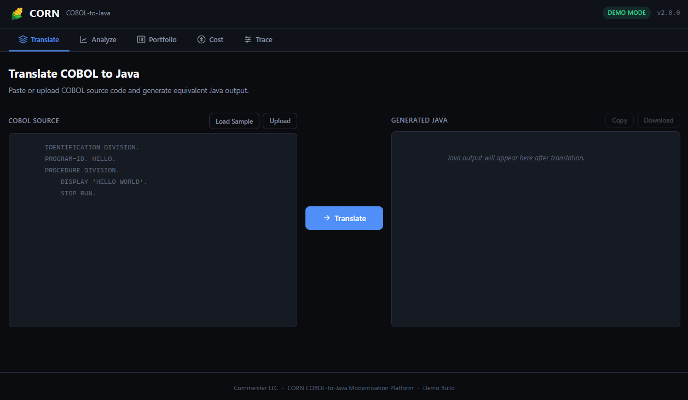
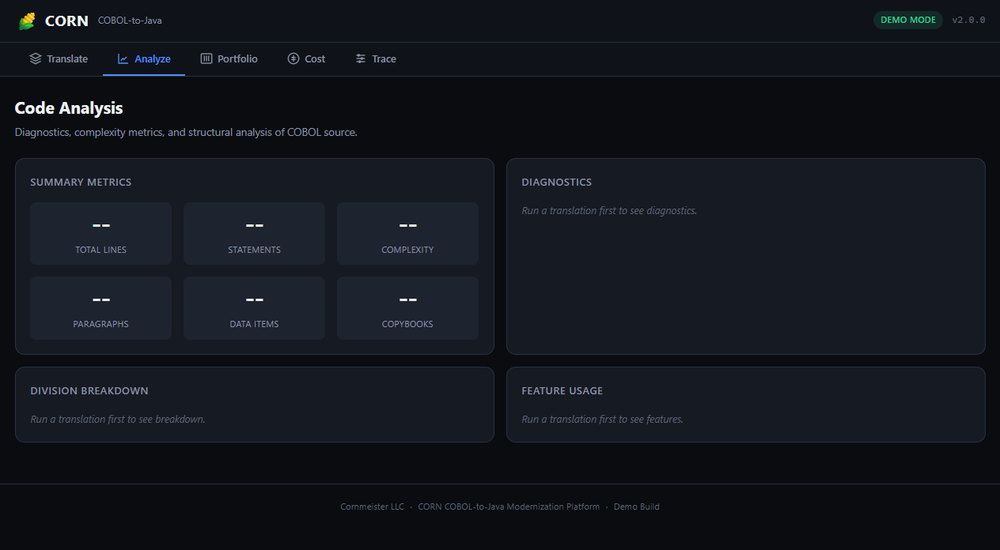
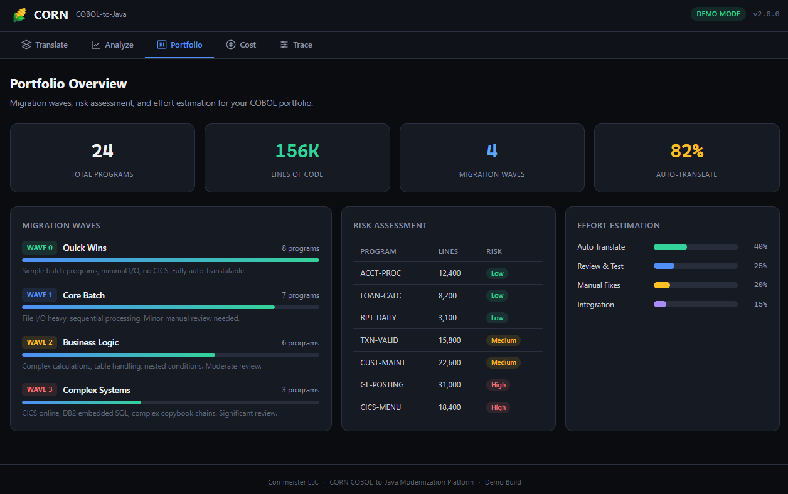
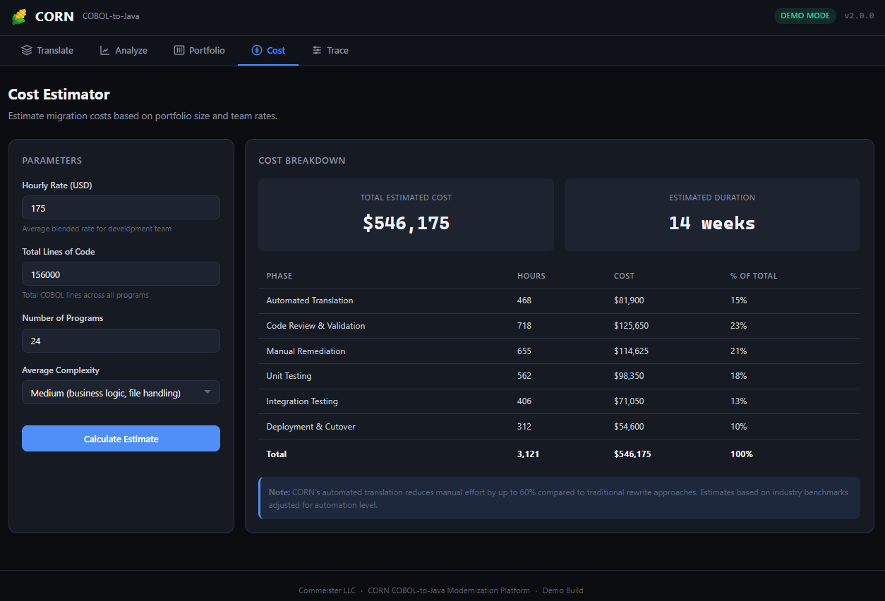
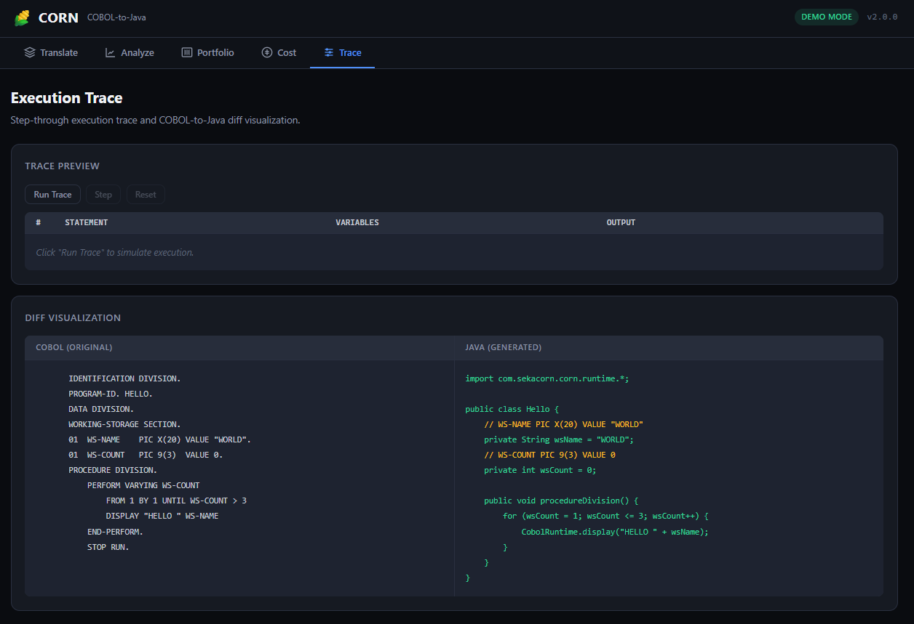

# Corn COBOL-to-Java Compiler

**Modernize millions of lines of COBOL — automatically, accurately, and on your terms.**

[](https://github.com/sekacorn/corn-cobol-to-java/actions/workflows/ci.yml)
[](LICENSE)
[](https://openjdk.org/)
[](https://maven.apache.org/)
[](#nist-ccvs85-conformance)

---

## The Problem

The world still runs on COBOL. 95% of ATM transactions, 80% of in-person transactions, and 43% of all banking systems depend on COBOL programs — many written 30-40 years ago. The developers who built them are retiring. The mainframe costs keep climbing. And the risk of doing nothing grows every quarter.

## The Solution

Corn is a **deterministic, rule-based COBOL-to-Java compiler** — not a black-box LLM that guesses. Every translation is reproducible, auditable, and traceable back to the original source. Built for the standards that financial institutions and government agencies demand.

---

## See It In Action

### Translate — COBOL In, Java Out

Paste any COBOL program. Get compilable Java in seconds. Side-by-side view with copy and download.



### Analyze — Know What You're Working With

Automatic complexity scoring, statement counts, division breakdown, feature detection, and parse diagnostics. Understand every program before you migrate it.



### Portfolio — Plan Your Migration Waves

See your entire COBOL portfolio at a glance. Programs are automatically grouped into migration waves by complexity and risk. Know exactly what moves first and what needs extra attention.



### Cost Estimator — Build the Business Case

Configure team rates and portfolio size. Get instant cost breakdowns by phase — automated translation, review, remediation, testing, and deployment. Built for the slide deck that gets the budget approved.



### Execution Trace — Prove Equivalence

Step-through execution trace with variable state tracking. Side-by-side COBOL/Java diff visualization. The evidence your auditors and regulators need.



---

## Why Corn

| | Traditional Rewrite | LLM Translation | **Corn** |
|---|---|---|---|
| **Deterministic** | Manual | No | **Yes** |
| **Auditable** | Depends on team | No | **Full trace** |
| **Reproducible** | No | No | **Every time** |
| **Cost** | $50-100/LOC | Unknown | **$3-5/LOC** |
| **Timeline** | Years | Months + rework | **Weeks to months** |
| **Regulatory ready** | Manual evidence | Not accepted | **Built-in compliance** |

---

## Platform Capabilities

### Implemented Today

- **ANTLR4-based COBOL parser** targeting ANSI-85 with 52.5% NIST CCVS85 conformance
- **Deterministic Java code generation** — same input always produces same output
- **Full pipeline**: parse, IR, generate, compile, execute, validate
- **40+ COBOL statement types** including arithmetic, control flow, file I/O, string operations, and INSPECT
- **508-compliant demo UI** with real-time translation, analysis, portfolio planning, and cost estimation
- **REST API server** for integration into existing workflows
- **Execution-based validation** against expected output fixtures

### Supported COBOL Statements

| Category | Statements |
|----------|-----------|
| **Arithmetic** | `ADD`, `SUBTRACT`, `MULTIPLY`, `DIVIDE`, `COMPUTE` (with `ROUNDED`, `ON SIZE ERROR`, `GIVING`, Format 1 & 2) |
| **Control Flow** | `IF`/`ELSE`, `EVALUATE`/`WHEN`, `PERFORM` (simple, `UNTIL`, `VARYING`, `TIMES`, `TEST BEFORE`/`AFTER`), `GO TO`, `STOP RUN`, `EXIT`, `GOBACK` |
| **Data Movement** | `MOVE`, `INITIALIZE`, `SET` |
| **I/O** | `DISPLAY`, `ACCEPT`, `OPEN`, `CLOSE`, `READ`, `WRITE`, `REWRITE`, `DELETE`, `START` |
| **String** | `STRING`, `UNSTRING`, `INSPECT` (`TALLYING`, `REPLACING`, `CONVERTING`) |
| **Program** | `CALL` (with `ON EXCEPTION`), `SEARCH`, `SORT`, `MERGE` |

---

## Screenshots — CLI

### CLI Help


### Translate Flow

Translating 9 COBOL programs to Java with zero errors:


### Validation Pipeline

Parse, generate, compile, execute — fully automated:


### Analyzer

JSON-based analysis report for every program:


---

## Sample Translation

**COBOL input:**
```cobol
       IDENTIFICATION DIVISION.
       PROGRAM-ID. ARITHMETIC.
       DATA DIVISION.
       WORKING-STORAGE SECTION.
       01  WS-A       PIC 9(5) VALUE 100.
       01  WS-B       PIC 9(5) VALUE 50.
       01  WS-RESULT  PIC 9(5) VALUE 0.
       PROCEDURE DIVISION.
           ADD WS-A TO WS-B GIVING WS-RESULT.
           DISPLAY "RESULT: " WS-RESULT.
           STOP RUN.
```

**Generated Java:**
```java
package com.generated.cobol;
import java.math.BigDecimal;
import com.sekacorn.corn.runtime.CobolMath;
import com.sekacorn.corn.runtime.ArithmeticContext;

public class Arithmetic {
    private BigDecimal wsA = new BigDecimal("100");
    private BigDecimal wsB = new BigDecimal("50");
    private BigDecimal wsResult = BigDecimal.ZERO;

    public void run() { mainPara(); }

    private void mainPara() {
        wsResult = CobolMath.compute(wsA.add(wsB),
            ArithmeticContext.ofPicture(0, 18)).getValue();
        System.out.println(String.valueOf("RESULT: ")
            + String.valueOf(wsResult));
        return;
    }

    public static void main(String[] args) { new Arithmetic().run(); }
}
```

---

## Quick Start

### Requirements

- Java 21
- Maven 3.8+

### Build

```bash
mvn clean install
```

### Run the Demo UI

```bash
java -jar modules/server/target/corn-demo-server.jar
# Open http://localhost:8085
```

### Run the CLI

```bash
java -jar modules/cli/target/corn-cobol-to-java.jar --help

# Translate COBOL to Java
java -jar modules/cli/target/corn-cobol-to-java.jar translate ./cobol \
  --output ./output/java --codegen-level 2

# Validate the full pipeline (parse → generate → compile → execute)
java -jar modules/cli/target/corn-cobol-to-java.jar validate ./cobol \
  --output ./corn-validation

# Analyze COBOL source
java -jar modules/cli/target/corn-cobol-to-java.jar analyze ./cobol
```

---

## Architecture

```text
COBOL source (.cbl)
  → CobolPreprocessor (fixed-form → free-form normalization)
  → ANTLR4 Lexer/Parser (CobolLexer.g4 / CobolParser.g4)
  → CobolIRBuildingVisitor (parse tree → immutable IR)
  → JavaCodeGenerator (IR → Java source via visitor pattern)
  → Generated Java (imports com.sekacorn.corn.runtime.*)
```

### Module Structure

```text
modules/
  ir/              Immutable IR: Program, DataItem, Statement (40+), Expression (8)
  lexer-parser/    ANTLR4 grammars, CobolSourceParser, CobolPreprocessor
  codegen-java/    JavaCodeGenerator, JavaStatementVisitor, JavaExpressionVisitor
  runtime-java/    CobolRuntime, CobolMath, CobolString, CobolFile (zero external deps)
  server/          Lightweight HTTP API for the demo UI (JDK HttpServer, zero extra deps)
  cli/             Picocli CLI: translate, validate, analyze, report, init, refactor, gui
```

---

## NIST CCVS85 Conformance

The parser is validated against the US government **NIST CCVS85** COBOL-85 compiler conformance test suite — 415 programs across 14 categories. This is the same test suite used to certify production COBOL compilers.

| Category | Pass | Total | Rate |
|----------|------|-------|------|
| RL (Relative I/O) | 18 | 26 | **69.2%** |
| SQ (Sequential I/O) | 55 | 84 | **65.5%** |
| IC (Inter-program Communication) | 30 | 47 | **63.8%** |
| IF (Intrinsic Functions) | 28 | 45 | **62.2%** |
| NC (Nucleus) | 58 | 95 | **61.1%** |
| IX (Indexed I/O) | 13 | 29 | 44.8% |
| OB (Obsolete) | 3 | 7 | 42.9% |
| ST (Sort/Merge) | 7 | 25 | 28.0% |
| SM (Source Management) | 3 | 13 | 23.1% |
| SG (Segmentation) | 3 | 13 | 23.1% |
| DB (Debug) | 0 | 15 | 0.0% |
| RW (Report Writer) | 0 | 6 | 0.0% |
| CM (Communication) | 0 | 9 | 0.0% |
| EX (EXEC) | 0 | 1 | 0.0% |
| **Total** | **218** | **415** | **52.5%** |

> These results measure successful parse + Java code generation. Conformance rate is actively improving with each release.

---

## Compliance & Standards

- **Section 508 / WCAG 2.1 AA** — Demo UI is accessibility-compliant with ARIA labels, keyboard navigation, skip links, and sufficient color contrast
- **NIST CCVS85** — Parser validated against the US government COBOL-85 compiler conformance test suite
- **NIST SP 800-218 (SSDF)** — Secure software development practices followed throughout
- **Zero copyleft dependencies** — No GPL/LGPL/AGPL in production scope
- **SBOM generation** — CycloneDX bill of materials generated on every build

---

## Roadmap

| Phase | Focus | Status |
|-------|-------|--------|
| **Core Pipeline** | Parse, IR, codegen, runtime, CLI | Shipped |
| **Demo Platform** | Web UI, REST API, portfolio/cost tools | Shipped |
| **NIST 75%+** | Grammar expansion, COPY/REPLACE preprocessing | In Progress |
| **Semantic Analysis** | Type checking, data flow, dead code detection | Private Repo |
| **Enterprise Features** | EXEC CICS, EXEC SQL, COMP-3 dialects, multi-program | Planned |
| **Production Platform** | Rust-based high-performance engine, cloud deployment | Private Repo |

---

## Repository Layout

```text
corn-cobol-to-java/
  demo-ui/           Web-based demo UI (HTML/CSS/JS)
  docs/              Architecture, patent application, value proposition
  modules/           Maven modules (ir, lexer-parser, codegen-java, runtime-java, server, cli)
  samples/           Sample COBOL programs
  README.md
  LICENSE
  pom.xml
```

## Documentation

- [Architecture](docs/ARCHITECTURE.md)
- [Value Proposition](docs/VALUE_PROPOSITION.md)

---

## Licensing

This repository is distributed under the **Corn Evaluation License** for non-production evaluation use. See [LICENSE](LICENSE) for the full terms.

For production licensing, enterprise agreements, or partnership inquiries:

**Cornmeister LLC** | `sekacorn@gmail.com`

---

*Built by Cornmeister LLC. Maryland, USA.*
